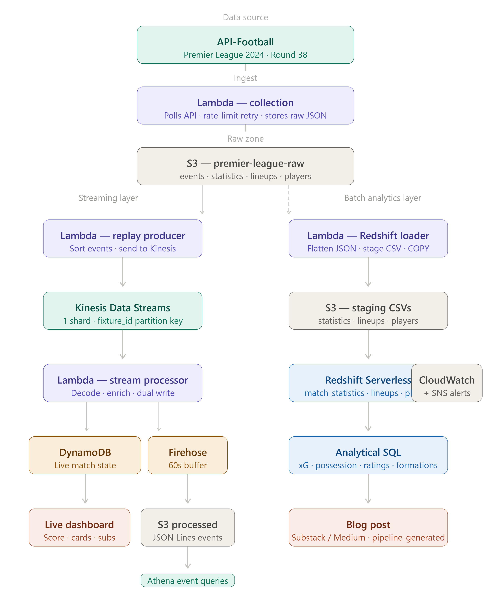

# Premier League Match Intelligence Pipeline
### AWS Real-Time Streaming + Analytics Project
 
A two-layer data platform covering the Premier League 2024 season's final matchday — a real-time event streaming pipeline for live match state, combined with a batch analytics layer powering post-match statistical analysis. Built on AWS using a Lambda architecture pattern.
 
---
 
## Problem Statement
 
Sports analytics platforms need two distinct capabilities: live match state for real-time dashboards (current score, cards, substitutions updated within seconds) and deep post-match statistical analysis for content and insights. These access patterns require fundamentally different storage and processing approaches. This pipeline serves both from a single data source using the right tool for each job.
 
---
 
## Architecture
 
```
API-Football (REST API)
        ↓
Lambda — Collection (scheduled)
        ↓
S3 (raw zone) — events, statistics, lineups, players per fixture
        ↓
        ├── Replay Producer Lambda
        │         ↓
        │   Kinesis Data Streams (1 shard)
        │         ↓
        │   Lambda Processor
        │         ↓                    ↓
        │   DynamoDB               Firehose
        │   (live state)               ↓
        │                         S3 (processed)
        │                              ↓
        │                          Athena
        │
        └── Redshift Loader Lambda
                  ↓
            S3 (staging CSVs)
                  ↓
            Redshift Serverless COPY
                  ↓
            match_statistics / match_lineups / match_players
                  ↓
            Analytical SQL → Blog post insights
```
 

 
---
 
## Dataset
 
**Source**: [API-Football](https://www.api-football.com/) — free tier
 
**Coverage**: Premier League 2024, Round 38 (final matchday) — 10 simultaneous matches
 
| Data Type | Endpoint | Records collected |
|---|---|---|
| Match events | `/fixtures/events` | ~150 events (goals, cards, substitutions) |
| Match statistics | `/fixtures/statistics` | 20 rows (2 teams × 10 fixtures) |
| Starting lineups | `/fixtures/lineups` | 220 rows (11 players × 2 teams × 10 fixtures) |
| Player performance | `/fixtures/players` | 308 rows (all players who played) |
 
---
 
## AWS Services Used
 
| Service | Role | Layer |
|---|---|---|
| AWS Lambda | Collection, replay, stream processing, Redshift load | Both |
| Amazon Kinesis Data Streams | Event stream ingestion (1 shard) | Streaming |
| Amazon Kinesis Firehose | S3 delivery from stream | Streaming |
| Amazon DynamoDB | Live match state store | Streaming |
| Amazon S3 | Raw, processed, and staging storage | Both |
| Amazon Redshift Serverless | Post-match analytical data warehouse | Batch |
| AWS Glue Crawler | Schema detection on processed events | Batch |
| Amazon Athena | SQL querying on event stream data | Batch |
| Amazon CloudWatch | Lambda monitoring and alerting | Both |
| Amazon SNS | Failure notifications | Both |
| AWS IAM | Least-privilege access per Lambda function | Both |
 
---
 
## Pipeline Stages
 
### Stage 1 — Data Collection Lambda
A scheduled Lambda polls API-Football for all 10 Round 38 fixture IDs, then fetches four endpoints per fixture — events, statistics, lineups, and player performance. Raw JSON responses stored as-is in S3:
 
```
premier-league-raw/
  round=38/
    fixture=1208393/
      events.json
      statistics.json
      lineups.json
      players.json
    fixture=1208394/
      ...
```
 
Rate limiting handled with exponential backoff retry logic. 42 total API requests — well within the 100/day free tier limit.
 
### Stage 2 — Event Replay Producer
A Lambda reads all `events.json` files from S3, merges events across all 10 fixtures, sorts chronologically by `time.elapsed`, and sends each event to Kinesis Data Streams as a shaped JSON record. Events from all 10 simultaneous matches interleave in chronological order — mirroring how a live system would receive them.
 
Key design: `fixture_id` used as Kinesis `PartitionKey` — all events from the same match route to the same shard, preserving intra-match ordering.
 
### Stage 3 — Lambda Stream Processor
Triggered automatically by Kinesis (batch size: 10). For each record:
 
1. **Decode** — base64 decode + JSON parse the Kinesis payload
2. **Enrich** — add `processed_at` timestamp and `is_key_event` flag (True for goals and red cards)
3. **Update DynamoDB** — running match state updated with conditional `ADD` expressions per event type
4. **Forward to Firehose** — enriched record forwarded as JSON Lines for S3 delivery
### Stage 4 — DynamoDB Live State
One item per fixture — updated in place with each event. Stores running counters:
 
```json
{
  "fixture_id": "1208399",
  "home_team": "Nottingham Forest",
  "away_team": "Chelsea",
  "home_score": 0,
  "away_score": 2,
  "home_yellow_cards": 2,
  "away_yellow_cards": 2,
  "home_substitutions": 3,
  "away_substitutions": 3,
  "last_event_type": "Substitution",
  "last_event_minute": 86,
  "last_event_player": "N. Madueke",
  "last_updated": "2024-05-19T16:26:00+00:00",
  "ttl": 1716667200
}
```
 
TTL set to 7 days — items auto-expire, keeping the table lean without manual cleanup.
 
### Stage 5 — Firehose → S3 → Athena
Firehose (Direct PUT source) buffers records and delivers to S3 every 60 seconds as JSON Lines. A Glue Crawler catalogs the output for Athena querying.
 
### Stage 6 — Redshift Analytics Layer
A separate Lambda reads `statistics.json`, `lineups.json`, and `players.json` from S3, flattens the nested JSON structures into tabular CSVs, stages them in S3, and triggers Redshift `COPY` commands for three tables:
 
- `match_statistics` — 20 rows, possession, shots, xG, pass accuracy per team per match
- `match_lineups` — 220 rows, starting XI with formation and position per match
- `match_players` — 308 rows, individual player ratings, goals, assists, passing stats
---
 
## Key Design Decisions
 
**Why Lambda architecture (streaming + batch from same source)?**
Live match state (DynamoDB) and deep statistical analysis (Redshift) have fundamentally different access patterns — sub-second reads vs complex multi-table aggregations. One storage layer can't serve both efficiently. The streaming layer handles "what's happening now" and the batch layer handles "what happened and why."
 
**Why DynamoDB for live state instead of RDS or Redshift?**
DynamoDB delivers single-digit millisecond reads at any scale with no connection management. A live scoreboard queried hundreds of times per second needs this — Redshift is optimised for analytical queries running seconds to minutes, not sub-millisecond point lookups.
 
**Why event replay from historical data instead of live API polling?**
API-Football's free tier allows 100 requests/day — insufficient for continuous live polling across 10 simultaneous matches. Event replay from pre-collected data is a standard production pattern for testing and backfilling streaming pipelines. The pipeline architecture is identical to a live system; only the producer changes.
 
**Why `fixture_id` as Kinesis PartitionKey?**
Events from the same match must arrive in order at the consumer (so the running score increments correctly). Using `fixture_id` as the partition key routes all events from one match to the same shard, preserving intra-match ordering while allowing events from different matches to be processed in parallel.
 
**Why one item per fixture in DynamoDB instead of one item per event?**
The live scoreboard access pattern is "give me the current state of match X" — a single point lookup. Storing one running-state item per fixture means this is always one DynamoDB read regardless of how many events have occurred. Storing every event as a separate item would require a query + aggregation on every read, which defeats the purpose of using DynamoDB for live state.
 
**Why Direct PUT for Firehose instead of Kinesis stream as source?**
When Firehose reads directly from Kinesis, it competes with the Lambda processor for stream throughput (2MB/s per shard limit). With Direct PUT, Lambda is the sole Kinesis consumer and explicitly forwards records to Firehose — clean separation of concerns, no throughput competition.
 
**Why CSV staging for Redshift COPY instead of loading JSON directly?**
Redshift's JSON COPY requires a `jsonpaths` manifest file mapping every nested JSON field path to a table column. Flattening to CSV in Lambda first keeps the COPY command simple and the column mapping obvious. For a dataset this size, the extra Lambda step costs milliseconds.
 
---
 
## Analytical Findings (Premier League Round 38, 2024)
 
> **Note**: replace these placeholders with your actual Redshift query results before publishing.
 
### xG vs Actual Goals — Who Was Lucky/Unlucky?
 
| Team | xG | Actual Goals | Difference |
|---|---|---|---|
| [fill in] | [fill in] | [fill in] | [fill in] |
 
*[Your analysis here — e.g. "X had an xG of 2.4 but scored 0, making them the most statistically unlucky team on the final matchday"]*
 
### Possession vs Outcome
 
| Home Team | Away Team | Home Possession | Away Possession | Result |
|---|---|---|---|---|
| [fill in] | [fill in] | [fill in] | [fill in] | [fill in] |
 
*[Your analysis here — e.g. "X of 10 matches were won by the team with less possession, challenging the common assumption that possession dominance predicts victory"]*
 
### Top Performers by Rating
 
| Player | Team | Rating | Goals | Assists | Minutes |
|---|---|---|---|---|---|
| [fill in] | [fill in] | [fill in] | [fill in] | [fill in] | [fill in] |
 
### Goal Involvement Leaders
 
| Player | Team | Goals | Assists | Total Involvement |
|---|---|---|---|---|
| [fill in] | [fill in] | [fill in] | [fill in] | [fill in] |
 
### Formation Analysis
 
| Formation | Teams Using | Home | Away |
|---|---|---|---|
| [fill in] | [fill in] | [fill in] | [fill in] |
 
---
 
## Event Stream Sample (from Athena)
 
**Matchday event timeline highlights:**
 
- Minute 17 — Tottenham penalty goal (D. Solanke)
- Minute 45+1 — Aston Villa goalkeeper (E. Martínez) red card — goalkeeper dismissal on final matchday
- Minute 64 — Brighton second goal (J. Hinshelwood, brace)
- Minute 88 — Brighton penalty (M. O'Riley) — dramatic late winner
- Minute 90+3 — Brighton fourth goal (D. Gómez) — emphatic finish
*Brighton scored 4 goals against Tottenham in a match that was 1-1 at half time — the most dramatic result of the matchday.*
 
---
 
## What I Would Improve in Production
 
- **Idempotent DynamoDB updates** — current `ADD` operations double-count if the same event is replayed. Production would track processed event IDs and skip duplicates.
- **SQS Dead Letter Queue** — failed Lambda records currently log and continue. A DLQ would capture failed records for inspection and replay without data loss.
- **Enhanced fan-out for Kinesis consumers** — at scale, multiple consumers (Lambda + Firehose) competing for standard shard throughput causes throttling. Enhanced fan-out gives each consumer a dedicated 2MB/s pipe.
- **Parquet for Firehose output** — JSON Lines works for this dataset size but Parquet would reduce Athena scan costs significantly at production event volumes.
- **DECIMAL instead of FLOAT for statistics** — `possession`, `pass_accuracy`, and `expected_goals` stored as DECIMAL would avoid floating point precision issues in aggregations.
- **Parameterise fixture list and round number** — hardcoded fixture IDs make the pipeline brittle. Production would dynamically fetch fixture IDs from the API at runtime.
- **Separate IAM roles per Lambda** — all three Lambdas share minimal roles, but production would scope each role to only the specific resources that Lambda touches.
---
 
## Repository Structure
 
```
premier-league-pipeline/
  lambda_functions/
    collection/
      lambda_function.py        ← API fetch + S3 raw storage
    replay_producer/
      lambda_function.py        ← S3 read + Kinesis send
    stream_processor/
      lambda_function.py        ← Kinesis decode + DynamoDB + Firehose
    redshift_loader/
      lambda_function.py        ← S3 read + flatten + Redshift COPY
  redshift_queries/
    xg_vs_actual_goals.sql
    possession_vs_outcome.sql
    top_performers_by_rating.sql
    goal_involvement.sql
    formation_analysis.sql
  athena_queries/
    event_timeline.sql
    goals_by_team.sql
    cards_by_team.sql
    busiest_minutes.sql
  architecture/
    pipeline_diagram.png
  README.md
```
 
---
 
## How to Reproduce
 
1. **Sign up for API-Football** free tier at `dashboard.api-football.com` — get API key
2. **Create AWS account** and set billing alert
3. **Create S3 buckets** — `premier-league-raw` and `premier-league-processed`
4. **Deploy collection Lambda** — set timeout to 5 minutes, attach S3 write role
5. **Run collection Lambda** — fetches all Round 38 data (~42 API requests)
6. **Create Kinesis Data Stream** — `premier-league-events`, 1 shard, provisioned
7. **Create DynamoDB table** — `premier-league-live`, partition key `fixture_id` (String), TTL enabled on `ttl` attribute, on-demand capacity
8. **Create Firehose stream** — `premier-league-events-firehose`, Direct PUT source, S3 destination, 60s buffer
9. **Deploy stream processor Lambda** — attach Kinesis trigger (batch size 10, TRIM_HORIZON), attach DynamoDB and Firehose write permissions
10. **Deploy replay producer Lambda** — attach S3 read and Kinesis write permissions, timeout 5 minutes
11. **Run replay producer** — sends ~150 events through the pipeline
12. **Verify DynamoDB** — 10 items with correct match states
13. **Verify S3** — JSON Lines files appearing in processed bucket after 60 seconds
14. **Create Redshift Serverless workgroup** — 8 RPU minimum, attach S3 read role as default
15. **Create three Redshift tables** — run CREATE TABLE statements from `redshift_queries/`
16. **Deploy Redshift loader Lambda** — attach S3 read/write and Redshift Data API permissions
17. **Run loader Lambda** — loads statistics, lineups, players into Redshift
18. **Query in Redshift Query Editor v2** — run analytical queries
**Estimated AWS cost**: $5–10 for a complete build including Redshift Serverless (~$2.88/hour, delete when done). Delete Redshift workgroup and Kinesis stream immediately after use.
 
⚠️ **Important**: delete Redshift Serverless workgroup and Kinesis Data Stream when done — these are the only services that charge while idle.
 
---
 
## Skills Demonstrated
 
- Lambda architecture design (streaming + batch from single source)
- Real-time event streaming with Kinesis Data Streams and Lambda
- DynamoDB data modelling for live state (running counters, TTL, partition key design)
- Kinesis Firehose delivery pipeline with Direct PUT pattern
- Redshift Serverless loading via S3 staging and COPY command
- REST API data collection with rate limiting and retry logic
- Event replay pattern for historical data through streaming infrastructure
- Multi-Lambda IAM role design with least-privilege scoping
- Analytical SQL including CTEs, window functions, and multi-table joins
 
